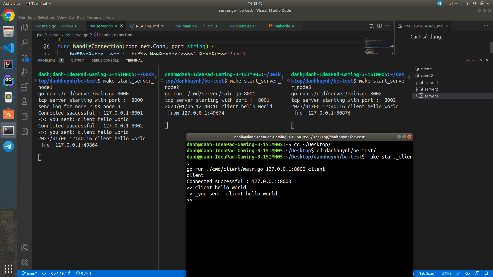

# be-test
## Cách sử dụng:
* Để start một server

Ví dụ server 1:

```
    make start_server_node1
```
* Để connect đến một server

Trong make file đã có config để có thể giao tiếp chéo với nhau. 

Ví dụ Muốn connect tới server 2:
```
    make start_client_node12
```

## Thuật toán đồng thuận Raft:
* Ở đây tôi sẽ chọn server 1 làm node leader thì khi có dữ liệu với đầu vào miễn có từ đầu là **client** giả sử là request bên ngoài gọi vào leader thì dữ liệu sẽ được truyên đi cho các node còn lại.
```
    client hello world
```
* Thì sau khi leader nhận nhận được dữ liệu sẽ tiến hành send dữ liệu đó cho các node còn lại với mục địch là hiển thị hoặc là lưu trử lại.

